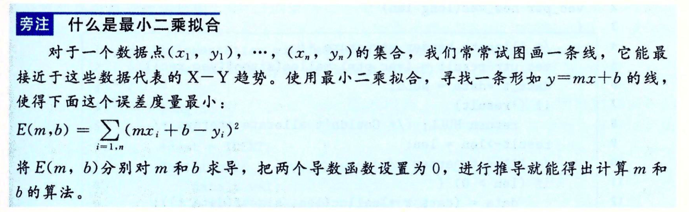

# 优化程序性能

### 编写高效程序需要做到以下几点：
		
1. 选择一组适当的算法和数据结构
2. 编写出编译器能够有效优化以转换成高效可执行代码的源代码
3. map-reduce型并行计算
	
...... 在实现和维护程序的简单性与它的运行速度之间做出权衡
	
...... 程序的简洁可读性和模块性 与它的优化进行权衡
	
### 程序性能衡量指标
	
1.响应时间
	  
	系统对用户行为或者事件做出响应的时间。响应时间越短，性能一定越好。（异步）

2.启动时间
	 
	应用系统从运行到可以正常处理业务所需要花费的时间

3.执行时间
	
	一段代码从开始运行到运行结束，所使用的时间。有些时候可能无法减少全局化的时间，但是可以通过把业务逻辑切分到多段连续的程序中，让用户感觉执行时间减短了

4.执行速度
	
	程序的反应是否迅速，响应时间是否足够短。该指标与响应时间、执行时间是相关联的。

5.计算资源分配
	
	计算资源包括CPU、内存、磁盘等，如果其中的任何一项分配不合理，可能会导致整个系统始终处于计算资源紧张的情况下，这样对于整个系统性能影响一定是毁灭性的。

6.内存分配	
	
	内存分配是否合理，是否过多地消耗内存或内存泄漏，例如JVM性能与内存分配有一定的关系。

7.磁盘吞吐量
	
	描述I/O的使用情况。IOPS（每秒的输入输出量/读写次数，适用于随机读写频繁的应用），是衡量磁盘性能的主要指标之一。IOPS是指单位时间内系统能处理的I/O请求数，I/O请求通常为读或写数据操作请求。
	数据吞吐量指单位时间内可以成功传输的数据数量。适用于大量顺序读写

8.网络吞吐量
	  
	描述网络的使用情况。
	  
9.负载承受能力
	
	当系统压力上升时，系统的执行速度、响应时间的上升曲线是否平缓。负载承受能力与计算资源、内存、磁盘、网络等多方面因素都有关联。
	
### 程序优化

	1. 编写更有效率的代码 消除不必要的工作（例如：不必要的函数调用、条件测试和内存引用、使用更高效的算法）-- 为了使程序性能最大化，程序员和编译器都需要一个目标机器的模型，
	   指明如何处理指令，以及各个操作的时序性 （例如：编译器必须知道时序信息，才能确定是用乘法指令，还是用移位和加法的某种组合）
	2. 利用处理器提供的指令级并行能力，同时执行多条指令
	3. 减少锁竞争
	
### 性能优化策略
	
	1. 用空间换时间
	2. 用时间换空间
	3. 简化代码
	4. 并行处理
	
### 优化编译器的能力和局限性

	1.大多数编译器，包括GCC，向用户提供了一些对他们所使用的优化的控制（例如："-Og"调用GCC让GCC使用一组基本的优化，"-O2"或"-O3"可以更大的优化）
	2.编译器必须很小心地对程序只使用安全的优化，也就是说对于程序可能遇到的所有可能的情况。

exp1: 
```
	void twiddle1(long *xp, long *yp) {
		*xp += *yp;
		*xp += *yp;
	}
与
	vodi twiddle2(long *xp, long *yp) {
		*xp += 2* (*yp);
	}
的比较。
```
exp2: 	
```	
	x = 1000; y = 3000;
	*q = y;
	*p = x;
	t1 = *q;
	t1的计算值依赖于指针p和q是否指向内存中同一个位置 --- 如果不是， t1等于3000，否则1000
```
exp3: 
```
  long f();
  long func1() {
      return f() + f() + f() + f();
   }
  
  long func2() {
      return 4 * f();
  }

  int counter = 0;
  long f() {
  	return counter++;
  }
```

### 表示程序性能
	 
1. 度量标准
	 
	 * 每元素的周期数（CPE） --- 作为一种表示程序性能并指导改进代码
	 * 处理器活动的顺序是由时钟控制的，时钟提供了某个频率的规律信号。
	 * 时钟周期的度量值表示执行了多少条指令，而不是时钟运行的有多快
	
2. 迭代的处理过程	
	
	计算向量的前置和：
		a=<a[0], a[1], ..., a[n-1]> 前置和：p=<p[0], p[1],..., p[n-1]>
	定义：
		p[0] = a[0];
		p[i] = p[i-1] + a[i], 1 <= i < n 
	
	```
      void psum1(float a[], float p[], long n) 
      {
      	long i;
      	p[0] = a[0];
      	for (i = 1; i < n; i++)
      	  p[i] = p[i-1] + a[i];
      }
      	
      void psum2(float a[], float p[], long n) 
      {
      	long i;
      	p[0] = a[0];
      	for (i = 1; i < n-1; i+=2) {
      		float mid_val = p[i-1] + a[i];
      		p[i] = mid_val;
      		p[i+1] = mid_val+ a[i+1];
      	}
      		
      	if (i < n) p[i] = p[i-1] + a[i];
      }
	```		
 


3. 消除循环的低效率
4. 减少过程调用
5. 消除不必要的内存引用
6. 理解现代处理器

		1.整体操作
		2.功能单元的性能
		3.处理器操作的抽象模型
		
7. 循环展开
8. 提高并行性
