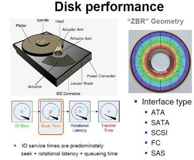
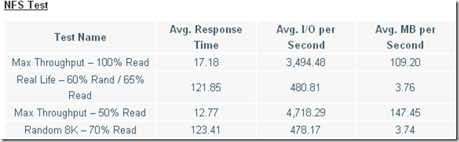
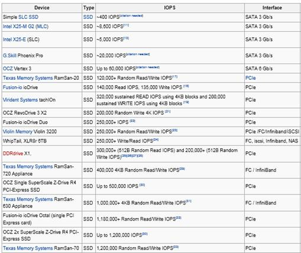

## 磁盘性能评价指标-- IOPS和吞吐量

### 磁盘I/O的概念

I/O的概念，从字义来理解就是输入输出。操作系统从上层到底层，各个层次之间均存在I/O。比如，CPU有I/O，内存有I/O，VMM有I/O，底层磁盘上也有I/O，
这是广义上的I/O。通常来讲，一个上层的I/O可能会产生针对磁盘的多个I/O，也就是说，上层I/O是稀疏的，下层的I/O是密集的。

磁盘的I/O，顾名思义就是磁盘的输入输出。输入指的是对磁盘写入数据，输出指的是从磁盘读出数据。我们常说的磁盘类型有ATA、SATA、FC、SCSI和SAS等，
如下图所示。这几种磁盘中，服务器常用的是SAS和FC磁盘，一些高端存储也是使用SSD盘。每一种磁盘的性能是不一样的。
                                      
                                      
   
   
### 磁盘评价指标

SAN（Storage Area Network, 存储区域网络）和NAS存储（Network Attached Storage，网络附加存储)一般都具备2个评价指标：
IOPS和带宽（throughput），两个指标互相独立又相互关联。体现存储系统性能的最主要指标是IOPS。下面，将介绍一下这两个参数的含义。

IOPS (Input/Output Per Second)即每秒的输入输出量(或读写次数)，是衡量磁盘性能的主要指标之一。IOPS是指单位时间内系统能处理的I/O请求数量，
I/O请求通常为读或写数据操作请求。随机读写频繁的应用，如OLTP(Online Transaction Processing)，IOPS是关键衡量指标。
另一个重要指标是数据吞吐量(Throughput)，指单位时间内可以成功传输的数据数量。对于大量顺序读写的应用，如VOD(Video On Demand)，则更关注吞吐量指标。

* 简而言之：
	
	> 1.磁盘的IOPS，也就是在一秒内，磁盘进行多少次 I/O 读写。\
	> 2.磁盘的吞吐量，也就是每秒磁盘 I/O 的流量，即磁盘写入加上读出的数据的大小。

* IOPS 与吞吐量的关系:

	> 每秒 I/O 吞吐量＝ IOPS* 平均 I/O SIZE。从公式可以看出： I/O SIZE 越大，IOPS 越高，那么每秒 I/O 的吞吐量就越高。
	因此，我们会认为 IOPS 和吞吐量的数值越高越好。实际上，对于一个磁盘来讲，这两个参数均有其最大值，而且这两个参数也存在着一定的关系。

* IOPS可细分为如下几个指标：

	> 1.Toatal IOPS，混合读写和顺序随机I/O负载情况下的磁盘IOPS，这个与实际I/O情况最为相符，大多数应用关注此指标。\
	> 2.Random Read IOPS，100%随机读负载情况下的IOPS。\
	> 3.Random Write IOPS，100%随机写负载情况下的IOPS。\
	> 4.Sequential Read IOPS，100%顺序读负载情况下的IOPS。\
	> 5.Sequential Write IOPS，100%顺序写负载情况下的IOPS。

下图为一个典型的NFS测试结果：

IOPS的测试benchmark工具主要有Iometer, IoZone, FIO等，可以综合用于测试磁盘在不同情形下的IOPS。对于应用系统，需要首先确定数据的负载特征，
然后选择合理的IOPS指标进行测量和对比分析，据此选择合适的存储介质和软件系统。

* IOPS计算公式

	对于磁盘来说一个完整的IO操作是这样进行的：当控制器对磁盘发出一个IO操作命令的时候，磁盘的驱动臂(Actuator Arm)带读写磁头(Head)离开
	着陆区(Landing Zone，位于内圈没有数据的区域)，移动到要操作的初始数据块所在的磁道(Track)的正上方，这个过程被称为寻址(Seeking)，
	对应消耗的时间被称为寻址时间(Seek Time);但是找到对应磁道还不能马上读取数据，这时候磁头要等到磁盘盘片(Platter)旋转到初始数据块所在的
	扇区(Sector)落在读写磁头正上方的之后才能开始读取数据，在这个等待盘片旋转到可操作扇区的过程中消耗的时间称为旋转延时(Rotational Delay);
	接下来就随着盘片的旋转，磁头不断的读/写相应的数据块，直到完成这次IO所需要操作的全部数据，这个过程称为数据传送(Data Transfer)，
	对应的时间称为传送时间(Transfer Time)。完成这三个步骤之后一次IO操作也就完成了。
	
	在我们看硬盘厂商的宣传单的时候我们经常能看到3个参数，分别是平均寻址时间、盘片旋转速度以及最大传送速度，这三个参数就可以提供给我们计算上述
	三个步骤的时间。
	
	第一个寻址时间，考虑到被读写的数据可能在磁盘的任意一个磁道，既有可能在磁盘的最内圈(寻址时间最短)，也可能在磁盘的最外圈(寻址时间最长)，
	所以在计算中我们只考虑平均寻址时间，也就是磁盘参数中标明的那个平均寻址时间，这里就采用当前最多的10krmp硬盘的5ms。
  
  第二个旋转延时，和寻址一样，当磁头定位到磁道之后有可能正好在要读写扇区之上，这时候是不需要额外额延时就可以立刻读写到数据，但是最坏的情况
  确实要磁盘旋转整整一圈之后磁头才能读取到数据，所以这里我们也考虑的是平均旋转延时，对于10krpm的磁盘就是(60s/10k)*(1/2) = 2ms。
  
  第三个传送时间，磁盘参数提供我们的最大的传输速度，当然要达到这种速度是很有难度的，但是这个速度却是磁盘纯读写磁盘的速度，因此只要给定了单次 
  IO的大小，我们就知道磁盘需要花费多少时间在数据传送上，这个时间就是IO Chunk Size / Max Transfer Rate。
  
  现在我们就可以得出这样的计算单次IO时间的公式:
    
    IO Time = Seek Time + 60 sec/Rotational Speed/2 + IO Chunk Size/Transfer Rate
  
  于是我们可以这样计算出IOPS:
    
     IOPS = 1/IO Time = 1/(Seek Time + 60 sec/Rotational Speed/2 + IO Chunk Size/Transfer Rate)
     
  对于给定不同的IO大小我们可以得出下面的一系列的数据:
  > 4K (1/7.1 ms = 140 IOPS) \
    5ms + (60sec/15000RPM/2) + 4K/40MB = 5 + 2 + 0.1 = 7.1 \
    8k (1/7.2 ms = 139 IOPS) \
    5ms + (60sec/15000RPM/2) + 8K/40MB = 5 + 2 + 0.2 = 7.2 \
    16K (1/7.4 ms = 135 IOPS) \
    5ms + (60sec/15000RPM/2) + 16K/40MB = 5 + 2 + 0.4 = 7.4 \
    32K (1/7.8 ms = 128 IOPS) \
    5ms + (60sec/15000RPM/2) + 32K/40MB = 5 + 2 + 0.8 = 7.8 \
    64K (1/8.6 ms = 116 IOPS) \
    5ms + (60sec/15000RPM/2) + 64K/40MB = 5 + 2 + 1.6 = 8.6
    
  从上面的数据可以看出，当单次IO越小的时候，单次IO所耗费的时间也越少，相应的IOPS也就越大。
  
  上面我们的数据都是在一个比较理想的假设下得出来的，这里的理想的情况就是磁盘要花费平均大小的寻址时间和平均的旋转延时，这个假设其实是比较符合
  我们实际情况中的随机读写，在随机读写中，每次IO操作的寻址时间和旋转延时都不能忽略不计，有了这两个时间的存在也就限制了IOPS的大小。
  现在我们考虑一种相对极端的顺序读写操作，比如说在读取一个很大的存储连续分布在磁盘的的文件，因为文件的存储的分布是连续的，磁头在完成一个
  读IO操作之后，不需要从新的寻址，也不需要旋转延时，在这种情况下我们能到一个很大的IOPS值，如下。
  
  > 4K (1/0.1 ms = 10000 IOPS) \
  　0ms + 0ms + 4K/40MB = 0.1 \
  　8k (1/0.2 ms = 5000 IOPS) \
  　0ms + 0ms + 8K/40MB = 0.2 \
  　16K (1/0.4 ms = 2500 IOPS) \
  　0ms + 0ms + 16K/40MB = 0.4 \
  　32K (1/0.8 ms = 1250 IOPS) \
  　0ms + 0ms + 32K/40MB = 0.8 \
  　64K (1/1.6 ms = 625 IOPS) \
  　0ms + 0ms + 64K/40MB = 1.6
  
  相比第一组数据来说差距是非常的大的，因此当我们要用IOPS来衡量一个IO系统的系能的时候我们一定要说清楚是在什么情况的IOPS，也就是要说明读写的
  方式以及单次IO的大小，当然在实际当中，特别是在OLTP的系统的，随机的小IO的读写是最有说服力的。
  
  另外，对于同一个磁盘（或者 LUN），随着每次 I/O 读写数据的大小不通，IOPS 的数值也不是固定不变的。例如，每次 I/O 写入或者读出的都是连续
  的大数据块，此时 IOPS 相对会低一些；在不频繁换道的情况下，每次写入或者读出的数据块小，相对来讲 IOPS 就会高一些。也就是说，IOPS 也取决
  与I/O块的大小，采用不同I/O块的大小测出的IOPS值是不同的。 对一个具体的IOPS, 可以了解它当时测试的I/O块的尺寸。并且IOPS都具有极限值，
  表1列出了各种磁盘的 IOPS 极限值。

 
 
### 三、I/O 读写的类型

> 大体上讲，I/O 的类型可以分为：读 / 写 I/O、大 / 小块 I/O、连续 / 随机 I/O, 顺序 / 并发 I/O。在这几种类型中，我们主要讨论一下：大 / 小块 I/O、连续 / 随机 I/O, 顺序 / 并发 I/O。

* 大 / 小块 I/O
	
> 这个数值指的是控制器指令中给出的连续读出扇区数目的多少。如果数目较多，如 64，128 等，我们可以认为是大块 I/O；反之，如果很小，比如 4，8，我们就会认为是小块 I/O，实际上，在大块和小块 I/O 之间，没有明确的界限。

* 连续 / 随机 I/O

> 连续 I/O 指的是本次 I/O 给出的初始扇区地址和上一次 I/O 的结束扇区地址是完全连续或者相隔不多的。反之，如果相差很大，则算作一次随机 I/O

> 连续 I/O 比随机 I/O 效率高的原因是：在做连续 I/O 的时候，磁头几乎不用换道，或者换道的时间很短；而对于随机 I/O，如果这个 I/O 很多的话，会导致磁头不停地换道，造成效率的极大降低。

* 顺序 / 并发 I/O

> 从概念上讲，并发 I/O 就是指向一块磁盘发出一条 I/O 指令后，不必等待它回应，接着向另外一块磁盘发 I/O 指令。对于具有条带性的 RAID（LUN），对其进行的 I/O 操作是并发的，例如：raid 0+1(1+0),raid5 等。反之则为顺序 I/O。

### 四、磁盘 I/O 性能的监控

监控磁盘的 I/O 性能，我们可以使用 AIX 的系统命令，例如：sar -d, iostat, topas, nmon 等。下面，我将以 nmon 和 topas 为例，讲述在系统
中如何观察磁盘 I/O 的性能。

topas: 登录 AIX 操作系统，输入 topas，然后按 D，会出现如下界面, 在上图中，TPS 即为磁盘的 IOPS，KBPS 即为磁盘每秒的吞吐量。由于服务器处
于空闲的状态，我们可以看到 IOPS，KBPS 的数据都非常低。

我们使用 dd if 命令向磁盘 hdisk2 发读 I/O，block 大小为 1MB：

利用 topas 进行监控：此时，hdisk2 的吞吐量为 163.9M，IOPS 为 655。

需要指出的是，使用 dd if 测量磁盘的带宽是可行的，但是由此来确定业务 I/O 的 IOPS 和吞吐量是不科学的。因为，dd if 所发起的读写仅为顺序 
I/O 读写，在 OLTP 的业务中，这种读写是不常见的，而是随机小 I/O 比较多，因此，测量业务的磁盘 I/O 性能，需要在运行业务的时候进行监控。

### 五、磁盘 I/O 性能调优

  确认磁盘 I/O 存在性能问题
  
  对于随机负载，当遇到余下情况时，我们那通常认为存在 I/O 性能问题：

     1. 平均读时间大于 15ms
     
     2. 在具有写 cache 的条件下，平均写时间大于 2.5ms

对于顺序负载，当遇到余下情况时，我们那通常认为存在 I/O 性能问题：

     1. 在一个磁盘上有两个连续的 I/O 流

     2. 吞吐量不足（即远远小于磁盘 I/O 带宽）

对于一块磁盘来讲，随着 IOPS 数量的增加，I/O service 也会增加，并且会有一个饱和点，即 IOPS 达到某个点以后，IOPS 再增加将会引起 
I/O service time 的显著增加。

从经验上讲，我们在测试工作中，我们主要关注 IOPS 和吞吐量以及磁盘的 busy% 这三个数值。如果 IOPS 和吞吐量均很低，磁盘的 busy% 也很低，
我们会认为磁盘压力过小，造成吞吐量和 IOPS 过低；只有在 IOPS 和吞吐量均很低，磁盘的 busy% 很高（接近 100%）的时候，我们才会从磁盘 I/O 
方面分析 I/O 性能。
